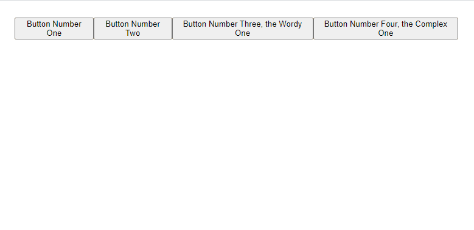

# React Minimal Tooltip, a small and simple tooltip library.


Tooltips can be displayed on top of or underneath the content they're describing. The tooltips will center themselves based on the location of their element and shrink in accordance to the page width. The tooltip can display any react node, not just strings.

But before you go any further: Do you even need a tooltip library? Maybe something like [the title attribute](https://developer.mozilla.org/en-US/docs/Web/HTML/Global_attributes/title) will suit your needs.

## Why use this over the other libraries?
Unlike the most popular React tooltip library which works via data tags, this library is in my opinion more 'reacty' and works via wrapping the element you wish to display a tooltip for in a component.

This package is also a bit smaller than other popular alternatives.

## Installation
```
npm install react-minimal-tooltip
```
```
yarn add react-minimal-tooltip
```

## Use
The simplest example:

``` javascript
import Tooltip from 'react-minimal-tooltip'

<Tooltip tooltipChildren="I am a tooltip">
  // the content the tooltip is for
  <button>Hover over me!</button>
</Tooltip>
```

## API
Below is the API for the default exported tooltip component. Note that this component wraps a div around the node the the tooltip is for, any prop given to the Tooltip component not mentioned below is passed through to that div:

Prop|Type|Required|Info|Default
-|-|-|-|-
hoverDurationUntilVisible|number|false|The amount of time in ms the cursor needs to be over the element until the tooltip appears|500
children|react node|true|the element the tooltip is for|N/A
tooltipChildren|react node|true|the content of the tooltip|N/A
tooltipPosition|string|false|the position of the tooltip, should be 'top' or 'bottom'|'top'
tooltipColor|string|false|valid css/style color, note that this is applied separately from `tooltipStyle` as the color is also applied to an svg element|'#d1d1d1'
tooltipStyle|object|false|style object that's applied to the visible part of the tooltip wrapper|{}
tooltipClassName|string|false|css className that's applied to the visible part of the tooltip wrapper|''
tooltipZIndex|number|false|z-index applied to the tooltip|1
tooltipPointerSize|number|false|size of the pointy part of the tooltip|12
tooltipSpacing|number|false|space between the tooltip and the item it's describing|0
tooltipFade|boolean|false|whether or not the tooltip should use a fade animation|true
tooltipFadeDuration|string|false|duration of the fade animation|'0.2s'
tooltipFadeEasingFunction|string|false|easing function used for the fade animation|'east-in-out'

## Advanced

Two other components are exported `HoverDetector` and `TooltipWrapper`. These are the consituent parts of the main exported Tooltip component, if you want to do something a bit more funky then looking at these components in the src will be great fun, they're not that complicated.

## Advice
I recommend creating your own wrapper around this component in your project, that way you can set sensible defaults for things like colors and hover durations. You can also name the props whatever you want if you think mine are a little to wordy.

## Thing to keep in mind
This component works by putting a div around the node the tooltip is describing. This both gives an element to listen to mouse events on, as well as an "anchor" to use to position the tooltip itself. Just keep that wrapping div in mind when adding tooltips to your layout. Remember that you can pass props like `className` or `style` to the tooltip and they'll be passed through to this wrapping div as mentioned above in the API section.

The tooltip will shrink to fit the screen width if necessary, but it wont reposition itself if there's not enough room to display its content. For instance if you put a tooltip with position 'top' at the very top of your page it might be partially clipped off.

## Development

This was bootstrapped with Create React App and we use that for development.

To start the dev server:
```
yarn start
```

We have a custom webpack/babel setup we use to bundle the package into a module:
```
yarn build
```

## Todo
- Consider left and right positioning.
- Document and describe the other two exposed components.
- Tidy up the tooltip positioning logic.
- Consider automatic positioning changing.
- Add linting and tests, general clean up.
- proof read this readme
